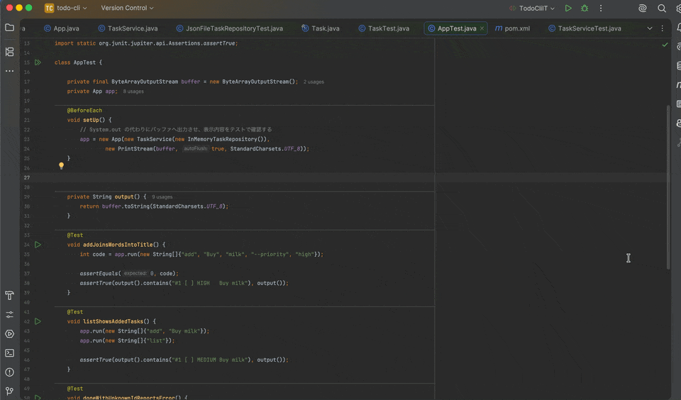

# Undo Tree for JetBrains



A port of Toby Cubitt's **Emacs undo-tree 0.8.2** for IntelliJ IDEA and PyCharm.
Keep abandoned redo branches and navigate them in an ASCII tree, with Emacs
visualizer keys enabled by default.

[日本語](README.ja.md) · [Usage and settings (日本語)](docs/USAGE.ja.md) · [Porting notes](docs/PORTING.md) · [Changelog](CHANGELOG.md)

```text
  o
  |
 / \
x   o
```

`x` marks the current state; `o` marks another state. Undoing and then editing
creates another branch while retaining the previous future.

- Restore any recorded state, including states on abandoned branches.
- Emacs ASCII layout, node symbols and active-branch highlighting; optional graphical view.
- Emacs / Standard keybinding options, with focus directed to the tree on opening.
- Selection without editing, an embedded diff preview, registers and Abort.
- Per-file history persistence, loaded only when the current text matches.

**Target:** IntelliJ IDEA / PyCharm **2025.1+** (Platform build 251+).
No Java or Python language plugin, Emacs installation, or Node.js runtime is
required to use the plugin.

**Status:** early development, version **0.2.0**. The Java core matches the
upstream Emacs history, ASCII drawing and keymap tests. Native IDE GUI behavior,
including keyboard focus, still needs verification on both products.

## Install

Install `undo-tree-jetbrains-0.2.0.zip` through **Settings → Plugins → ⚙ →
Install Plugin from Disk…**, then restart if prompted. Select the ZIP without
extracting it. The same package targets both IDEs.

To build the ZIP locally, use Python **3.9+**, an installed IDE and a JDK **21+**:

```sh
python3 scripts/build.py --ide "/path/to/your/IDE" --test
```

On macOS, for example:

```sh
python3 scripts/build.py --ide "/Applications/IntelliJ IDEA.app" --test
```

The output is `build/distributions/undo-tree-jetbrains-0.2.0.zip`.
The script uses the IDE's bundled compiler, or `JAVA_HOME` if none is bundled.
On Linux and Windows, pass the IDE installation directory. No dependency
downloads are needed for this build route.

## Use

Edit a text file and run **Tools → Undo Tree → Undo Tree: Visualize History**.
The tree takes keyboard focus on opening.

| Action | Windows / Linux | macOS |
| --- | --- | --- |
| Open tree | Ctrl+Alt+Z | Cmd+Option+Z |
| Undo Tree undo | Ctrl+Alt+U | Cmd+Option+U |
| Undo Tree redo | Ctrl+Alt+R | Cmd+Option+R |

With the tree focused and Emacs keys enabled:

| Keys | Action |
| --- | --- |
| ↑ / ↓, `p` / `n`, C-p / C-n | Undo / redo; move selection in Select mode |
| ← / →, `b` / `f`, C-b / C-f | Choose a redo branch; move selection in Select mode |
| C-↑ / C-↓, M-{ / M-} | Move to a branch point, saved state or register |
| `s`, Enter | Toggle Select mode; restore selection |
| `t`, `d`, `v` | Toggle timestamps, diff or ASCII / graphical view |
| `q`, C-q | Close; Abort returns to the opening state |

**C means Control on every OS. M means Alt / Option.** Change the defaults in
**Settings → Tools → Undo Tree**. Toolbar mode switches affect the current view.

The usual Cmd/Ctrl+Z still invokes the IDE's native undo. Assign your usual keys
to **Undo Tree: Undo / Redo** in **Settings → Keymap** to use the tree for those
shortcuts. Native and plugin grouping can differ; pre-plugin history is not imported.

History files contain **previous file contents** and are stored under `undo-tree/`
in the IDE system directory. Persistence is enabled by default. Emacs and VS Code
history files are not compatible, and regional undo is not implemented.

## Development

```sh
python3 scripts/test.py --jdk "/path/to/jdk-21-or-newer"
```

Tests compare 49 history traces, eight ASCII drawing cases, and both visualizer
keymaps with the original Emacs package. They also exercise persistence and
5,000 random history operations. If Emacs is installed, the original oracles run
again. GitHub Actions is configured for these core and Emacs checks.

See [CONTRIBUTING.md](CONTRIBUTING.md) for builds and IDE tests,
[manual GUI checks](docs/MANUAL_TEST.md) for validation, and
[release preparation](docs/RELEASING.md) for packaging and publication.

## Attribution and license

Adapted from [Toby Cubitt's undo-tree](https://www.dr-qubit.org/undo-tree.html),
via the [VS Code port](https://github.com/kentamt/undo-tree-vscode).
Original sources and provenance are retained in [upstream](upstream/README.md).

**GPL-3.0-or-later.** See [LICENSE](LICENSE) and [NOTICE](NOTICE).
